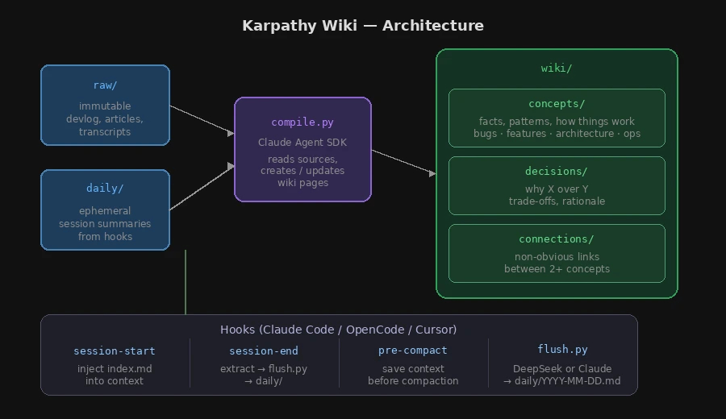

# Karpathy Wiki — LLM Knowledge Base

Permanent memory for AI coding assistants (Claude Code, OpenCode). Based on [Andrej Karpathy's method](https://gist.github.com/karpathy/442a6bf555914893e9891c11519de94f): Markdown Wiki instead of RAG.

## How It Works



**Two source types:**

| Source | Nature | Lifecycle |
|--------|--------|-----------|
| `raw/` | Manual: devlog, articles, transcripts | Immutable — never deleted |
| `daily/` | Auto: session summaries from hooks | Ephemeral — deleted after compilation |

**Models:**
- `flush.py` — DeepSeek (if API key set) **or** Claude Agent SDK (automatic fallback)
- `compile.py` — Claude Agent SDK (uses Claude Code subscription, not configurable)

## Quick Start

### 1. Install into your project

```bash
# Clone as submodule (recommended) or copy
cd /your/project
git submodule add https://github.com/<your-username>/andrej-karpathy-llm-memory.git andrej-karpathy-llm-memory

# Install Python dependencies
cd andrej-karpathy-llm-memory && uv sync && cd ..
```

### 2. Create the vault

```bash
# Copy template vault (rename as you like)
cp -r andrej-karpathy-llm-memory/templates/vault/ ./obsidian-vault
```

### 3. Connect hooks

#### Claude Code

```bash
# Copy hook config
cp -r andrej-karpathy-llm-memory/templates/.claude/ .claude/
```

> If `.claude/settings.json` already exists in your project, merge the `"hooks"` key
> from `templates/.claude/settings.json` into it manually rather than overwriting.

#### OpenCode

```bash
# Copy plugin
cp -r andrej-karpathy-llm-memory/templates/.opencode/ .opencode/
cd .opencode && npm install && cd ..

# Copy config (if opencode.json already exists, add "memory-compiler" to its "plugin" array)
cp andrej-karpathy-llm-memory/templates/opencode.json ./
```

#### Cursor AI

Requires **Cursor 1.7+** (hooks support).

```bash
# Copy hooks config into your project (create .cursor/ if it doesn't exist)
mkdir -p .cursor
cp andrej-karpathy-llm-memory/templates/cursor-hooks.json .cursor/hooks.json
```

> If `.cursor/hooks.json` already exists, merge the `"hooks"` key manually.

The hooks wired:
| Hook | When | What it does |
|------|------|-------------|
| `sessionStart` | Session starts | Reads `index.md` + recent daily log → injects into system context |
| `sessionEnd` | Session ends | Extracts transcript → spawns `flush.py` → daily log |
| `preCompact` | Before context compaction | Same as sessionEnd (saves context before it's lost) |

### 4. Add wiki instructions to CLAUDE.md

Append the content of `templates/CLAUDE.md.snippet` to your project's `CLAUDE.md`.

> If you renamed the vault (Step 2), also update every `obsidian-vault/` path in the
> snippet and in `.claude/skills/wiki-ingest/SKILL.md` to match your vault name.

### 5. Open in Obsidian (optional)

Point an Obsidian vault at your `obsidian-vault/` directory for graph view, backlinks, and search.

## Configuration (optional)

No API keys required — works out of the box with Claude Code subscription.

```bash
cp andrej-karpathy-llm-memory/.env.example andrej-karpathy-llm-memory/.env
cp andrej-karpathy-llm-memory/flush-config.json.example andrej-karpathy-llm-memory/flush-config.json
```

To use DeepSeek for cheaper session summarization, add your key to `.env`:
```
DEEPSEEK_API_KEY=sk-your-key-here
```

To customize vault path (default: `obsidian-vault` sibling to `andrej-karpathy-llm-memory/`):
```bash
echo "WIKI_VAULT_DIR=my-project-wiki" >> andrej-karpathy-llm-memory/.env
# or absolute path:
echo "WIKI_VAULT_PATH=/absolute/path/to/vault" >> andrej-karpathy-llm-memory/.env
```

## Usage

### Automatic

Hooks fire during coding sessions:
- **Session start** — injects wiki index into context (assistant "remembers")
- **Session end / idle** — extracts knowledge → `daily/` (DeepSeek or Claude as fallback)
- **Context compaction** — saves context before it's lost
- **After 18:00** — if daily log changed, auto-runs `compile.py`

### Manual

```bash
# Compile all unprocessed sources into wiki pages
uv run --directory andrej-karpathy-llm-memory python scripts/compile.py

# Compile only daily/ or raw/
uv run --directory andrej-karpathy-llm-memory python scripts/compile.py --source daily
uv run --directory andrej-karpathy-llm-memory python scripts/compile.py --source raw

# Compile a specific file
uv run --directory andrej-karpathy-llm-memory python scripts/compile.py --file raw/my-article.md

# Query the knowledge base
uv run --directory andrej-karpathy-llm-memory python scripts/query.py "How does auth work?"

# Health check
uv run --directory andrej-karpathy-llm-memory python scripts/lint.py
uv run --directory andrej-karpathy-llm-memory python scripts/lint.py --structural-only  # free, no LLM
```

### Interactive (via AI assistant)

Tell your assistant:
- **"ingest"** / **"обработай"** — processes sources into wiki
- **"remember this"** / **"note this"** — creates a wiki page from conversation
- **"lint the wiki"** — runs health checks

## Project Structure

```
andrej-karpathy-llm-memory/                  # This repo — add to any project as a submodule
├── assets/                      # Diagrams and images
├── scripts/
│   ├── compile.py               # Unified compiler: raw/ + daily/ → wiki/
│   ├── flush.py                 # Session → daily log (DeepSeek or Claude)
│   ├── query.py                 # Index-guided knowledge base Q&A
│   ├── lint.py                  # Health checks; saves reports to reports/ (auto-created)
│   ├── config.py                # Path constants (configurable via env vars)
│   └── utils.py                 # Shared helpers
├── hooks/                       # Hook scripts (Python) for all AI assistants
│   ├── session-start.py         # Claude Code: inject wiki index into session context
│   ├── session-end.py           # Claude Code: extract conversation → spawn flush.py
│   ├── pre-compact.py           # Claude Code: save context before auto-compaction
│   └── cursor/
│       ├── session-start.py     # Cursor AI: inject wiki index (sessionStart hook)
│       ├── session-end.py       # Cursor AI: extract conversation (sessionEnd hook)
│       └── pre-compact.py       # Cursor AI: save context before compaction
├── templates/                   # Copy these into your project once at setup
│   ├── vault/                   # Empty Obsidian vault skeleton
│   ├── .claude/                 # settings.json (hook wiring) + wiki-ingest skill
│   ├── .opencode/               # OpenCode memory plugin
│   ├── opencode.json            # OpenCode config
│   ├── cursor-hooks.json        # Cursor AI hooks config → copy to .cursor/hooks.json
│   └── CLAUDE.md.snippet        # Append to your project's CLAUDE.md
├── AGENTS.md                    # LLM agent schema: wiki structure, compile rules, conventions
├── pyproject.toml               # Python dependencies (uv)
├── .env.example                 # All supported environment variables with comments
├── .gitignore
└── flush-config.json.example    # Provider config reference (auto/deepseek/claude)
```

## Requirements

- Python 3.12+
- [uv](https://docs.astral.sh/uv/) package manager
- Claude Code subscription (for compile.py and flush.py fallback — uses built-in credentials)

Optional:
- DeepSeek API key (for cheaper session summarization via `flush.py`)
- [Obsidian](https://obsidian.md) for browsing the wiki

## Flush Provider Logic

`flush.py` selects the LLM provider automatically:

1. If `flush-config.json` sets `"flush_provider": "claude"` → uses Claude Agent SDK
2. If `flush-config.json` sets `"flush_provider": "deepseek"` → uses DeepSeek API (requires key)
3. If `flush-config.json` sets `"flush_provider": "auto"` (default) or is missing:
   - If `DEEPSEEK_API_KEY` is set → uses DeepSeek API
   - Otherwise → falls back to Claude Agent SDK (uses Claude Code subscription)

## Credits

- [Andrej Karpathy](https://gist.github.com/karpathy/442a6bf555914893e9891c11519de94f) — original method
- [Claude Agent SDK](https://github.com/anthropics/claude-agent-sdk-python) — agent loop for compile.py
